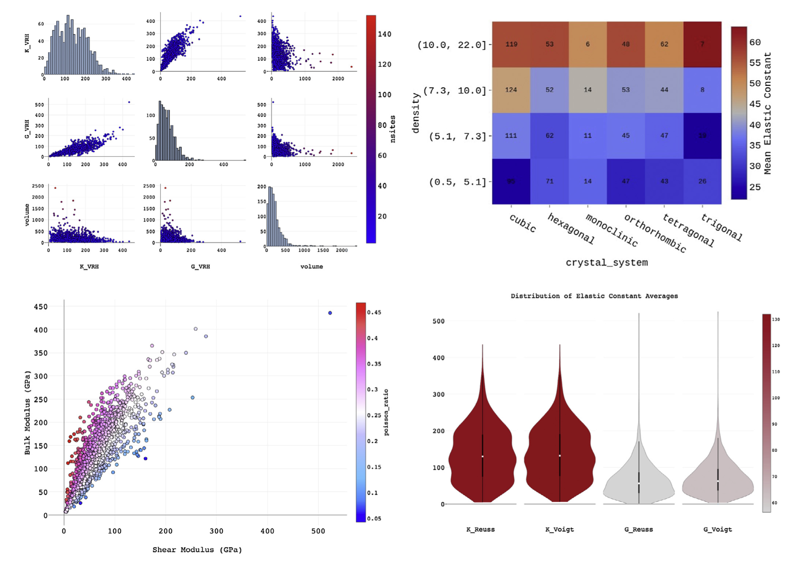

## FigRecipes

A repo to help with interactive plotting in data mining applications. Originally packaged with the [matminer code](https://github.com/hackingmaterials/matminer)

- [Source](https://github.com/hackingmaterials/figrecipes)
- [Docs](https://hackingmaterials.github.io/figrecipes)
- [Matminer code](https://github.com/hackingmaterials/matminer)

Find examples on the [matminer examples repo](https://github.com/hackingmaterials/matminer_examples). 